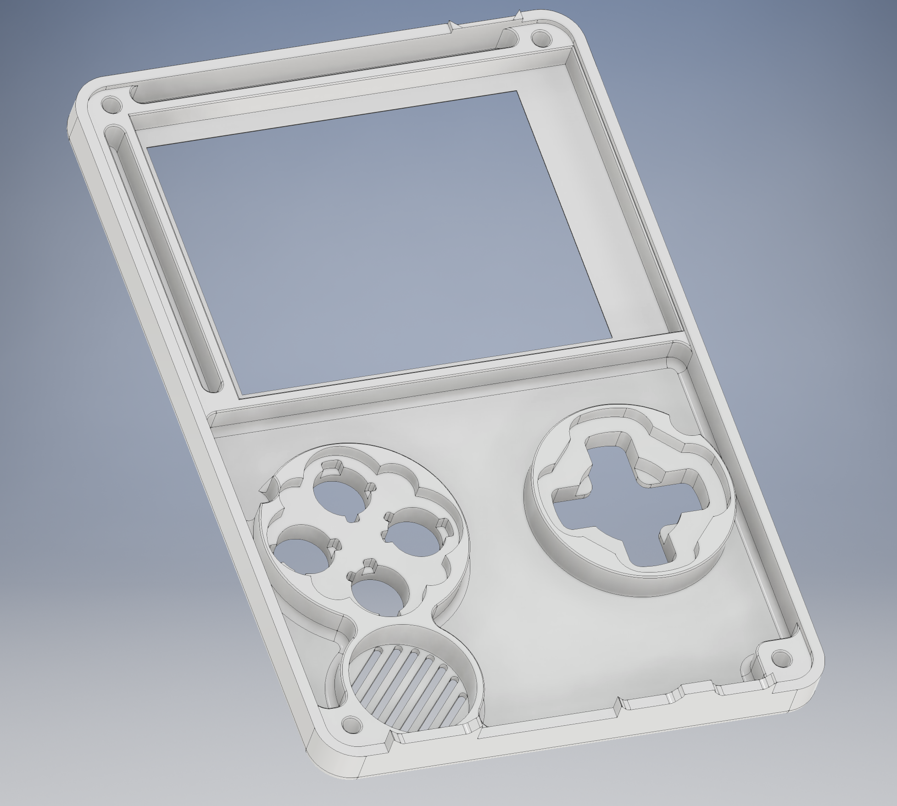
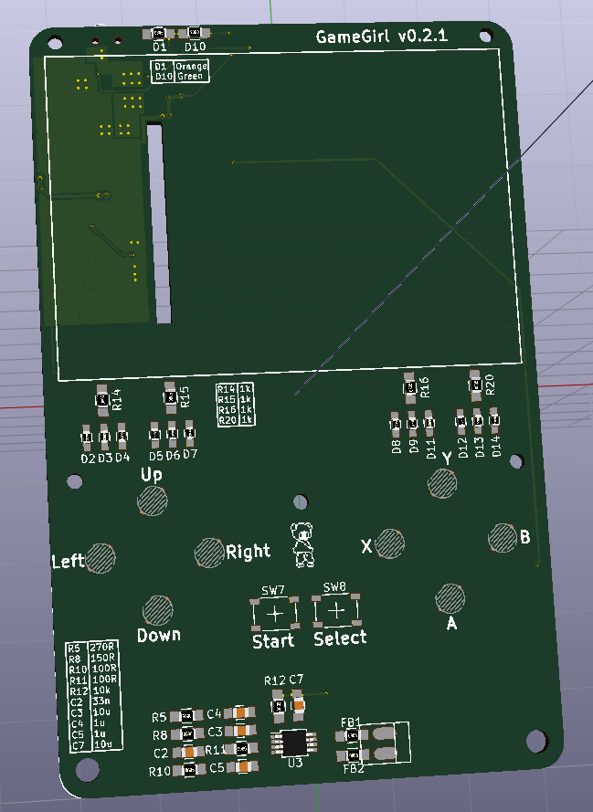
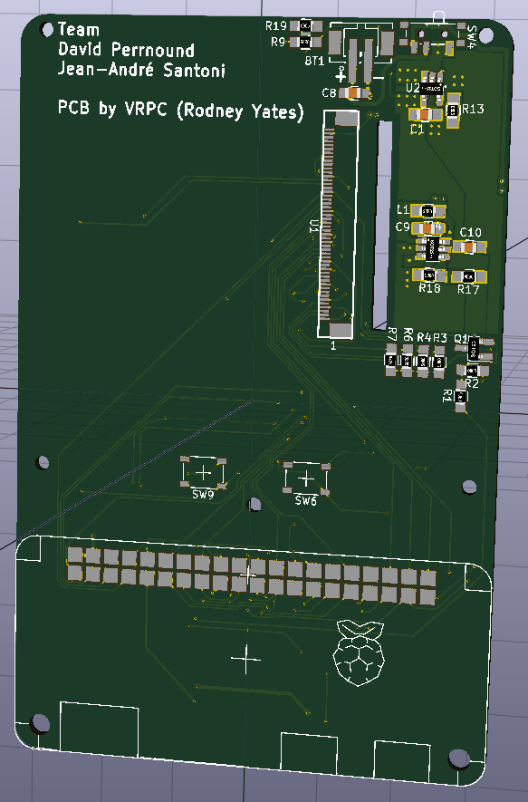

# Gamegirl

The most portable way to play LÖVE, PICO-8, Scratch or your favorite emulated games. Powered by RetroArch!

[Join us on our Discord Chat Channel!](https://discord.gg/TZ7MZEu)

# Table of Contents

* [Description](#Description)
* [Components](#Components)
* [Build your own!](#Build your own!)
* [Setup](#Setup)
* [Team](#Team)

# Description
We develop a very small, affordable and portable gaming console with a 320x240 display at 120 FPS run by a Raspberry Pi Zero.

**Project Goals:**
* Hardware accelerated display
* Custom software (Lakka / RetroArch)
* High quality case and buttons
* Small form factor

Gamegirl runs on the Lakka distribution powered by RetroArch because of its speed, fast power-on, instant power-off and its potential to run many retro and hipster-retro games (LÖVE, PICO-8, Scratch and emulators).

# Components
* 1 x Gamegirl custom PCB (audio, power, etc.)
* 1 × Raspberry Pi Zero
* 1 × 2.4" TFT display 320x240 (RGB 565 @ 120 FPS)
* 10 × soft rubber dome buttons
* 2 x metal dome buttons
* 1 × 15-16mm speaker
* 1 × 800+ mAh battery

# Build your own!

## Prototype v0.2 (_released_)
**v0.2** is the current development platform with multiple working prototypes in the field. It works but it's not perfect, yet!

 | 

### Gamegirl v0.2 - Schematic
* [Gamegirl_v0.2_Schematic.pdf](Electronics/Gamegirl_v0.2_Schematic.pdf)

### Gamegirl v0.2 - Bill Of Materials (BOM)

#### Minimal assembly variant
In this assembly variant you will get a working prototype without battery/charging and audio functionality. You can use it only while the Raspberry Pi Zero is connected to a USB power supply!
* [Gamegirl_v0.2-BOM_minimal.pdf](Electronics/Gamegirl_v0.2-BOM_minimal.pdf)

#### Full assembly variant
This assembly variant requires some circuit modifications to get audio output!
* [Gamegirl_v0.2-BOM.pdf](Electronics/Gamegirl_v0.2-BOM.pdf)

### Gamegirl Case v0.2
A 3D printable case design is currently in work.

## Prototype v0.2.1 (_work in progress_)
**v0.2.1** incorporates multiple improvements and fixes over v0.2. If you do not have a v0.2, you should wait for this!

|  |  |

**Improvements over v0.2:**
* Hand soldering friendlier layout
* Fixed mono audio circuit
* Fixed backlight function
* Button placement
* etc.

### Gamegirl v0.2.1 - Bill Of Materials (BOM)
(work in progress)

### Gamegirl Case v0.2.1
(work in progress)

# Setup
## Install the latest Lakka image on an SD Card

**Gamegirl Raspberry Pi Zero images:**
* [Nightly Builds](http://sources.lakka.tv/nightly/Gamegirl.arm-8.0/)
* [Build r21684 (November 29, 2016)](http://static.kivutar.me/Lakka-Gamegirl.arm-devel-20161129161645-r21684-g895e996.img.gz)
* [Build r21570 (August 23, 2016)](http://static.kivutar.me/Lakka-Gamegirl.arm-devel-20160823060147-r21570-g1cacbe2.img.gz)

**Instructions:**
* [How to write a image to an SD card on Windows & Mac OS](http://trendblog.net/install-raspbian-sd-card-os-x-windows/)

## First boot
As of nightly build 20170110005640-r25097, the system will take longer to boot as it is expanding the SD card partition and running other first boot operations. Subsequent boots will be faster.

## Installing your games
How-to [on lakka.tv](http://www.lakka.tv/get/linux/rpi/install/first-boot/games/)

# Team
|  |  |  
| --- | --- | --- |
| [David Perrenoud](https://github.com/davidperrenoud) | [Jean-André Santoni](http://www.kivutar.me/) - [Github](https://github.com/Kivutar) | [Rodney Yates](https://github.com/zybeon)

- [Jean-André] from France is the software guy of this project. He is the main Lakka developer and a top 5 RetroArch contributor.
- [David] from Switzerland is the hardware guy.
- [Rodney] from US is the PCB designer.

## Contributing
[Join us on our Discord Chat Channel!](https://discord.gg/TZ7MZEu)

### Project Task Tracker
[Trello page](https://trello.com/b/wslfYlVv/gamegirl)